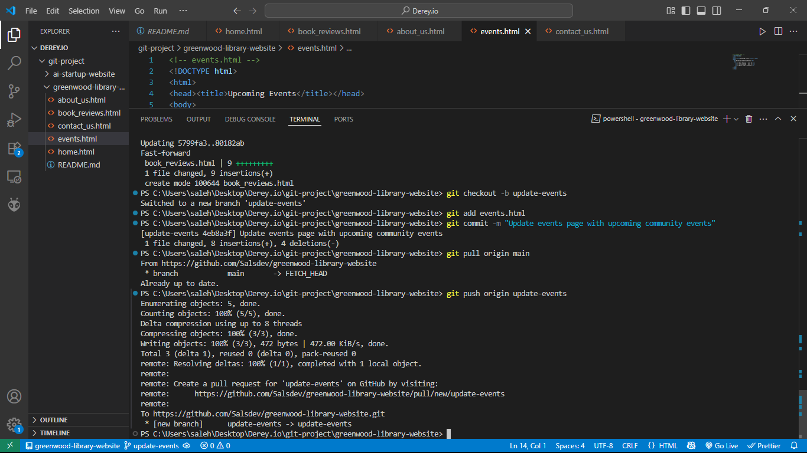
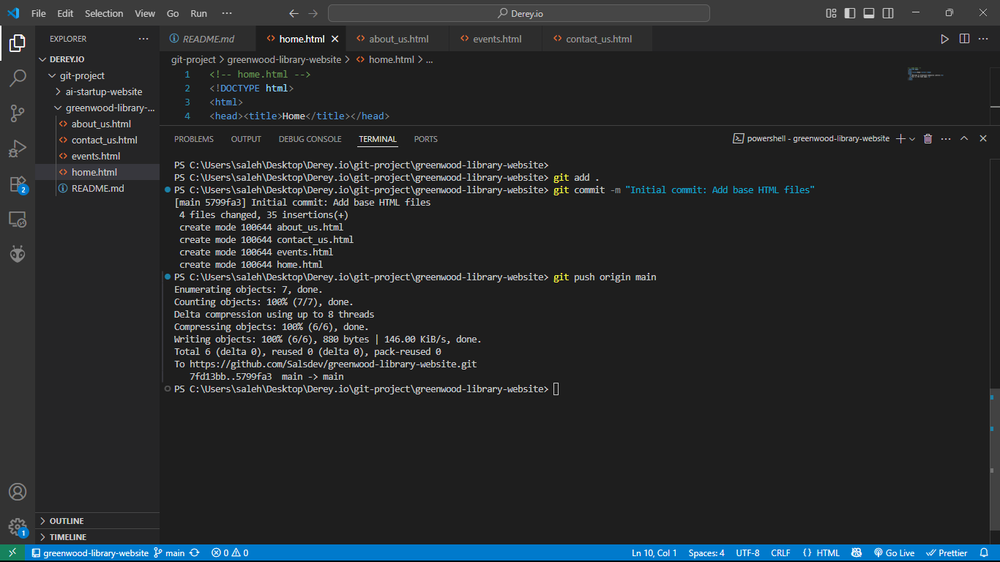
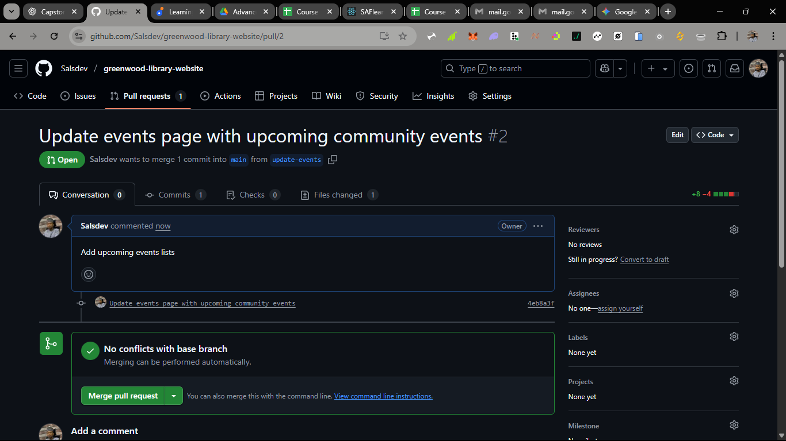
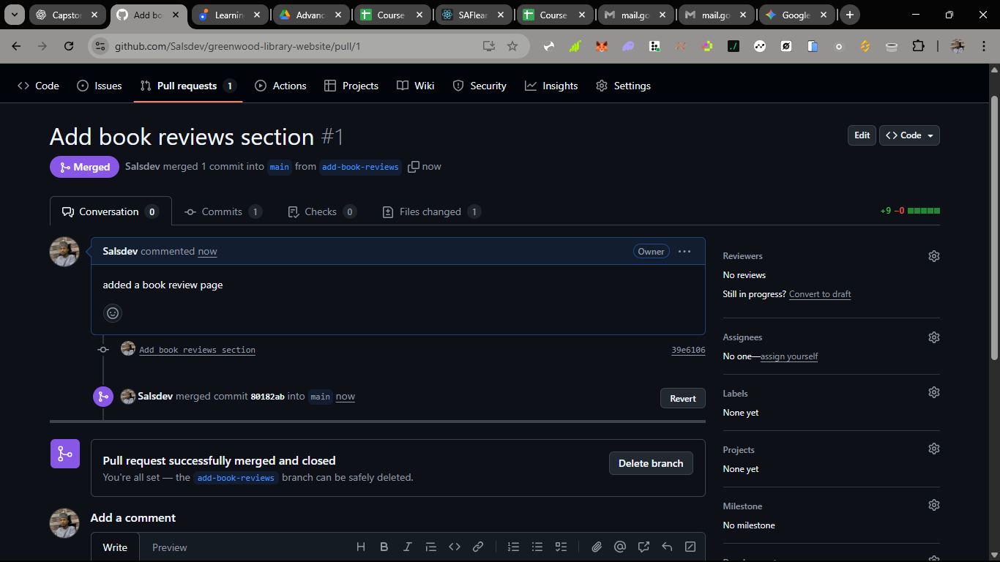

# Greenwood Community Library Website – CapStone Project

A guided Git workflow exercise for practicing **branching**, **collaborating via pull requests**, and **resolving merge conflicts** using a simple multi‑page site for the fictional **Greenwood Community Library**.

This README captures everything we did step‑by‑step (and what you or your learners can repeat):
- Create & initialize a GitHub repo
- Add starter pages on the `main` branch
- Create feature branches for contributors (Morgan & Jamie)
- Make changes, push, raise pull requests (PRs), and merge
- Sync local branches and resolve conflicts if needed

---

## Project Goals

This CapStone is designed to help learners become comfortable with day‑to‑day Git collaboration tasks used in real software teams. By the end, you should be able to:

- Initialize a repo & push starter code.
- Create feature branches and isolate work.
- Stage & commit changes with clear messages.
- Push branches and open pull requests (PRs).
- Review, merge, and sync branches.
- Pull changes and resolve merge conflicts.

---

## Quick Start

1. Create base pages on main:
   - touch home.html about_us.html events.html contact_us.html
   - git add .
   - git commit -m "Initial commit: Add base HTML pages"
   - git push origin main

2. Morgan: add book_reviews.html
   - git checkout -b add-book-reviews
   - git add book_reviews.html
   - git commit -m "Add book reviews section"
   - git push origin add-book-reviews
   - Open PR and merge on GitHub

3. Sync local main
   - git checkout main
   - git pull origin main

4. Jamie: update events.html
   - git checkout -b update-events
   - git add events.html
   - git commit -m "Update events page with upcoming community events"
   - git pull origin main
   - git push origin update-events
   - Open PR and merge

---

## Repository Structure

greenwood-library-website/
├── home.html
├── about_us.html
├── events.html
├── contact_us.html
├── book_reviews.html
├── README.md
└── screenshots/

---

## Screenshots

### ✅ Creating a Branch

### 📤 Pushing to GitHub

### 🔁 Creating a Pull Request

### ✅ Merging the Pull Request

### 🔄 Pulling Latest Changes

---

## Git Command Cheat Sheet

| Action                   | Command                                 |
|--------------------------|------------------------------------------|
| Clone repo               | git clone <url>                         |
| Check current branch     | git status                              |
| Create + switch branch   | git checkout -b <branch>                |
| Switch branches          | git checkout <branch> or git switch <branch> |
| Stage files              | git add .                               |
| Commit                   | git commit -m "message"                 |
| Push to remote           | git push origin <branch>                |
| Pull latest from remote  | git pull origin <branch>                |
| Delete local branch      | git branch -d <branch>                  |
| Delete remote branch     | git push origin --delete <branch>       |

---

## Final Notes

✅ Repo created  
✅ Base files added on `main`  
✅ Feature branches created and merged  
✅ Pull requests handled  
✅ Local `main` updated
